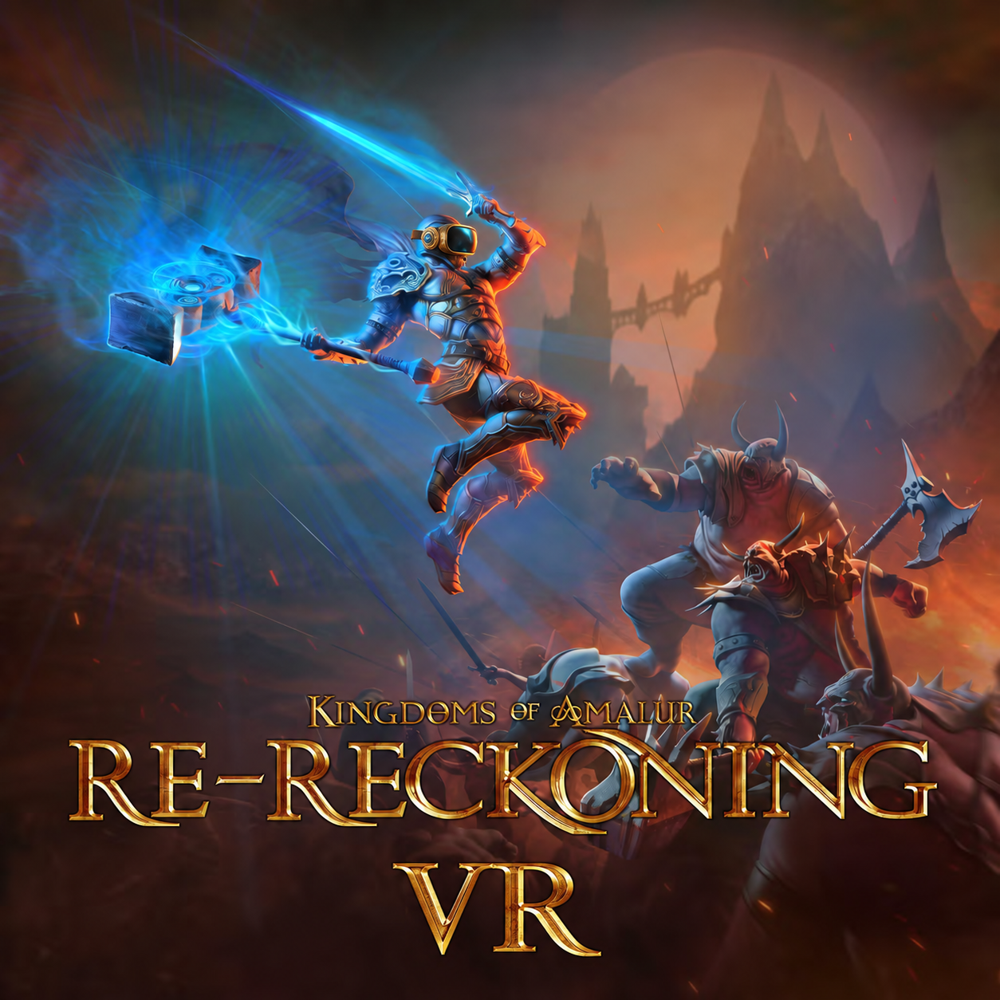
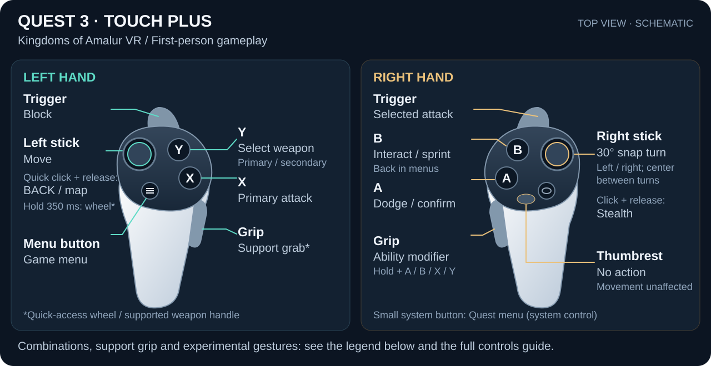

# Kingdoms of Amalur VR

**[Download (.zip)](https://github.com/n3rlspce/KingdomsOfAmalurVR/releases/download/v0.1.0-preview.6/KingdomsOfAmalurVR.zip)** · [Install guide](docs/INSTALL.md) · [Report a bug](https://tally.so/r/BzNXPK)

Experimental VR for **Re-Reckoning · Steam · Quest 3 · Virtual Desktop**.

Extract ZIP → add [Nexus framework](https://www.nexusmods.com/kingdomsofamalurrereckoning/mods/9) to `Dependencies` → run **Install and Launch.cmd**.

Other dependencies download automatically. Updates keep settings and saves.

Unofficial fan mod · [Artwork credits](docs/ARTWORK.md)

## Controls

**Click on both sticks to open VR settings.** Keep both sticks centered.

| Input | Action |
| --- | --- |
| Right grip + A/B/X/Y | Ability slot |
| Left trigger + right grip | Reckoning |
| Deflect left stick, then hold both stick clicks | D-pad: left = health; right = mana; up = aggressive mode |
| Left stick click: tap / hold 350 ms | Map / quick wheel |
| Left grip near supported weapon | Offhand support |
| Both stick clicks, centered | VR settings; release before navigating |
| Raised sword / right grip | Experimental longsword charge |

Menus: right stick navigates; face buttons keep native actions. Y selects weapon; right trigger attacks.

**[Full controls and gestures](CONTROLS.md)**

## Features

- First-person combat with physical melee. Spells auto-target like the original game.
- VR dialogue and full-VR cutscenes, except pre-rendered videos.
- Right grip over shoulder: tap to sheathe; hold to unsheathe.
- Automatically skips the menu and continues your latest save.
- Wrist HUD.
- Snap turning, physical crouching and seated mode.
